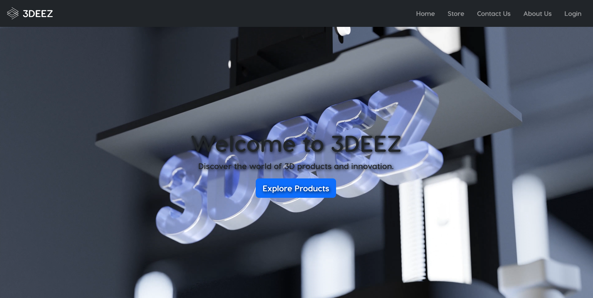
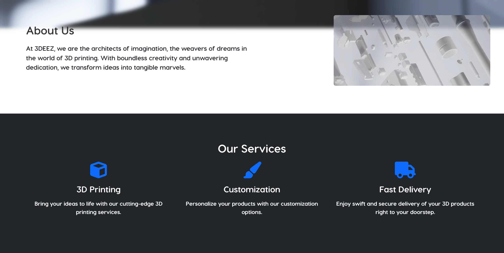
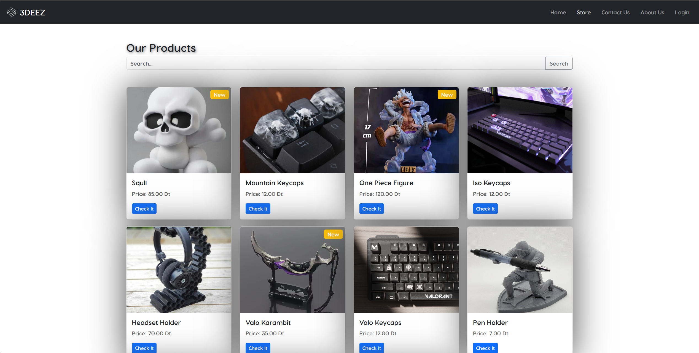

# 3DEEZ Online Store Web Application

Welcome to the **3DEEZ Online Store** web application repository! This project showcases an innovative e-commerce platform for **3D-printed items**, featuring a Back Office for administrators and a Front Office for customers and visitors.

---


## 🌟 Features

### **Back Office (Administrator's Dashboard)**
- **Product Management**: CRUD operations, search, and detailed product views.
- **User Authentication**: Secure login system with password management.
- **Extendable Functionalities**: Add custom features for better management.

### **Front Office (Customer Interface)**
- **Dynamic Product Display**: Showcase and search for products with details.
- **Promotional Section**: Fetch promotional info via external APIs.
- **Interactive Static Pages**: Engaging Home and About sections.
- **Store Page**: Seamlessly browse and explore items.

---

## 🌐 Screenshots

### **1. Home Page**


### **2. About Us Section**


### **3. Store Page**


---

## 🛠️ Functional Requirements

### **Back Office**
- CRUD operations and product search.
- Administrator login with secure authentication.
- Additional functionality for custom business needs.

### **Front Office**
- Product display and search with promotional integration.
- Static pages for Home and About.
- Detailed product views with intuitive navigation.

---

## 💻 Technical Stack and Requirements

1. **Frameworks**: Angular for the front end, JSON Server for mock backend.
2. **Design**: Built with Bootstrap and Angular Material.
3. **Routing**: Includes child routes, route guards, and lazy-loading for performance.
4. **Forms**: Reactive forms for robust input handling.
5. **Pipes & Directives**: Custom pipes and dynamic styling via `ngClass`.
6. **Deployment**: Surge.sh, Firebase, or similar platforms for hosting.

---

## 🚀 Getting Started

### **Clone the Repository**
```bash
git clone <repository-url>
```

### **Install Dependencies**
```bash
cd 3deez
npm install
```

### **Run the Application**
```bash
ng serve
```
Open your browser and navigate to `http://localhost:4200/` to view the application.

---

## 📚 JSON Server Setup

Simulate a backend with JSON Server:
1. **Install JSON Server**:
   ```bash
   npm install -g json-server
   ```
2. **Create a JSON Data File**:
   Add a `db.json` file in the root directory with your data.
3. **Start JSON Server**:
   ```bash
   json-server --watch db.json
   ```

Access the API at `http://localhost:3000/`.

---

## 🎉 Bonus Features

- **Firebase Integration** for hosting and database.
- **Advanced Angular Concepts** such as lazy-loading and modules.
- **Backend Integration** with Node.js or Spring Boot.

---

## 👥 Contributors

- [Laghouanem Sofien](https://github.com/CodeWizard-404)

---

## 📜 License

This project is licensed under the [ISET](LICENSE).
